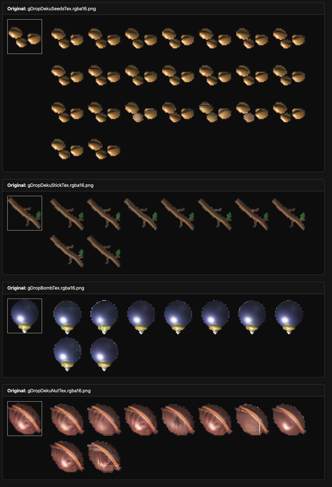
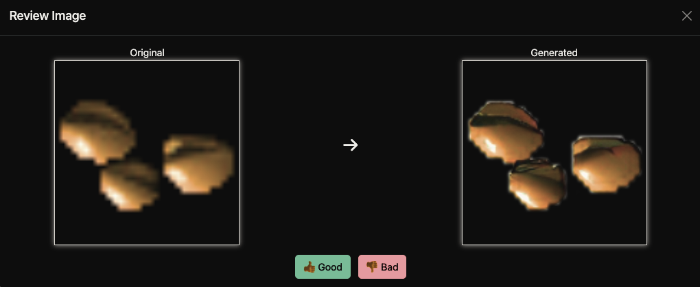

# Image Super Sampling API

A production-ready API for image super sampling using Stable Diffusion x4 upscaler with transparency preservation.

## 🚀 Features

- **AI-Powered Upscaling**: Uses Stable Diffusion x4 upscaler for high-quality image enhancement
- **Transparency Preservation**: Smart RGB+Alpha splitting to maintain transparency in game textures
- **GPU Acceleration**: Full CUDA support for fast processing
- **RESTful API**: Clean FastAPI endpoints for easy integration
- **Batch Processing**: Command-line tools for processing multiple images
- **Research-Optimized**: Parameters tuned based on SDXL research for optimal results
- **Review System**: Web-based UI for reviewing and rating generated images with automatic statistics tracking

## 📋 Requirements

- Python 3.10+
- CUDA-compatible GPU (recommended)
- Docker & Docker Compose
- 8GB+ VRAM for optimal performance

## 🛠️ Installation

### Using Docker (Recommended)

```bash
# Clone the repository
git clone https://github.com/alecKarfonta/supersample.git
cd supersample

# Build and start the API
docker compose up -d --build

# The API will be available at http://localhost:8888
```

### Manual Installation

```bash
# Install dependencies
pip install -r requirements.txt

# Start the API
python run.py
```

## 🎮 Usage

### API Endpoints

#### Upscale Image
```bash
curl -X POST "http://localhost:8888/api/v1/upscale" \
  -F "file=@your_image.png" \
  -F "prompt=game texture" \
  -F "noise_level=0.25" \
  -F "num_inference_steps=25" \
  -F "guidance_scale=7.5"
```

#### Health Check
```bash
curl "http://localhost:8888/api/v1/health"
```

#### Model Information
```bash
curl "http://localhost:8888/api/v1/model-info"
```

### Batch Processing

```bash
# Process all images in examples/ folder with default parameters
python3 batch_upscale.py

# Test different parameter combinations
python3 batch_upscale.py --noise-levels 0.1,0.25,0.5 --inference-steps 20,25,30 --guidance-scales 7.0,7.5,8.0 --prompts "game texture,detailed texture"

# Output will be saved to output/ folder
```

### Review System

The review system provides a web-based interface for evaluating generated images and tracking parameter performance.

#### Starting the Review UI

```bash
# Using Docker (recommended)
docker compose -f docker-compose.review.yml up -d

# The review UI will be available at http://localhost:5000
```

#### Using the Review Interface

1. **Browse Images**: The interface shows original images alongside all generated variations
2. **Rate Images**: Click any generated image to open a side-by-side comparison with the original
3. **Mark Quality**: Use thumbs up (👍) for good results or thumbs down (👎) for poor results
4. **Confirm Selections**: Click "Confirm Selections" to move rated images to `good_output/` or `bad_output/` folders
5. **View Statistics**: Click "View Stats" to see a leaderboard of parameter set performance

#### Statistics Tracking

The review system automatically tracks:
- Parameter combinations (noise level, inference steps, guidance scale, prompt)
- Success rates for each parameter set
- Individual image ratings with timestamps
- SQLite database (`review_stats.db`) for persistent storage

#### Parameter Set Leaderboard

Visit `http://localhost:5000/stats` to see:
- Ranked parameter sets by success rate
- Good/bad/total counts for each combination
- Percentage success rates
- Export capabilities for further analysis

## 🖼️ Review System UI Examples

Below are screenshots of the web-based review UI in action:

**Main Review Grid**


*The main review UI showing a grid of original and generated images for batch comparison and selection.*

**Review Modal (Side-by-Side Comparison)**


*The review modal displays a side-by-side comparison of the "Original" (left) and "Generated" (right) images. The original image is a low-resolution, pixelated texture of three gold or brown objects on a transparent background. The generated image shows the same objects, but upscaled with smoother edges and more detail, while preserving transparency. Below the images are "Good" (thumbs up) and "Bad" (thumbs down) buttons, allowing the user to rate the quality of the upscaled result.*

## 🔧 Configuration

### Environment Variables

- `MODEL_ID`: HuggingFace model ID (default: "stabilityai/stable-diffusion-x4-upscaler")
- `DEVICE`: Device to use ("cuda" or "cpu")
- `MAX_IMAGE_SIZE`: Maximum input image size in pixels
- `API_HOST`: API host (default: "0.0.0.0")
- `API_PORT`: API port (default: 8888)

### Docker Configuration

The `docker-compose.yml` file includes:
- GPU support with NVIDIA runtime
- Volume mounts for cache and temp directories
- Health checks
- Port mapping (8888)

The `docker-compose.review.yml` file includes:
- Review UI with Flask
- Volume mounts for examples, output, good_output, and bad_output folders
- Port mapping (5000)

## 🎯 Transparency Preservation

The API includes a sophisticated transparency preservation system:

1. **Detection**: Automatically detects images with alpha channels
2. **Splitting**: Separates RGB and Alpha components
3. **Processing**: 
   - RGB: Enhanced with Stable Diffusion
   - Alpha: Upscaled with high-quality Lanczos interpolation
4. **Recombination**: Combines enhanced RGB with preserved Alpha

This ensures game textures maintain their transparency behavior while getting AI enhancement.

## 📊 Performance

- **Processing Speed**: ~1.2s per image (GPU)
- **Memory Usage**: ~1.6GB VRAM during operation
- **Model Size**: ~5.7GB (downloaded once)
- **Upscale Factor**: 4x (32x32 → 128x128)

## 🧪 Testing

```bash
# Run API tests
python -m pytest app/tests/

# Manual testing
python test_client.py
```

## 📁 Project Structure

```
supersample/
├── app/
│   ├── api/
│   │   └── routes.py          # FastAPI endpoints
│   │   └── config.py          # Configuration management
│   │   └── schemas.py         # Pydantic models
│   │   └── model_manager.py   # Model loading & inference
│   └── main.py                # FastAPI application
├── examples/                  # Input images
├── output/                    # Processed images
├── good_output/               # Rated good images
├── bad_output/                # Rated bad images
├── templates/                 # Review UI templates
├── batch_upscale.py          # Batch processing script
├── review_ui.py              # Review system Flask app
├── docker-compose.yml        # Main API Docker configuration
├── docker-compose.review.yml # Review UI Docker configuration
├── Dockerfile.review         # Review UI container definition
├── requirements_review.txt    # Review UI dependencies
├── review_stats.db           # SQLite database for ratings
├── docker-compose.yml        # Docker configuration
├── Dockerfile                # Container definition
├── requirements.txt           # Python dependencies
└── README.md                 # This file
```

## 🔬 Research & Optimization

The API uses research-optimized parameters based on SDXL studies:

- **Noise Level**: 0.25 (preserves original structure)
- **Inference Steps**: 25 (optimal for SDXL upscaling)
- **Guidance Scale**: 7.5 (sweet spot for upscaling)

The review system enables systematic parameter optimization by tracking which combinations produce the best results for your specific use case.

## 📈 Review System Benefits

- **Systematic Evaluation**: Compare multiple parameter combinations side-by-side
- **Data-Driven Optimization**: Use statistics to identify the best parameters for your images
- **Transparency Preservation**: Maintain alpha channels throughout the review process
- **Batch Processing**: Efficiently review large numbers of generated images
- **Persistent Tracking**: SQLite database maintains rating history across sessions

## 🚀 Quick Start with Review

1. **Generate Images**: Run batch processing with parameter combinations
   ```bash
   python3 batch_upscale.py --noise-levels 0.1,0.25,0.5 --inference-steps 20,25,30
   ```

2. **Start Review UI**: Launch the review interface
   ```bash
   docker compose -f docker-compose.review.yml up -d
   ```